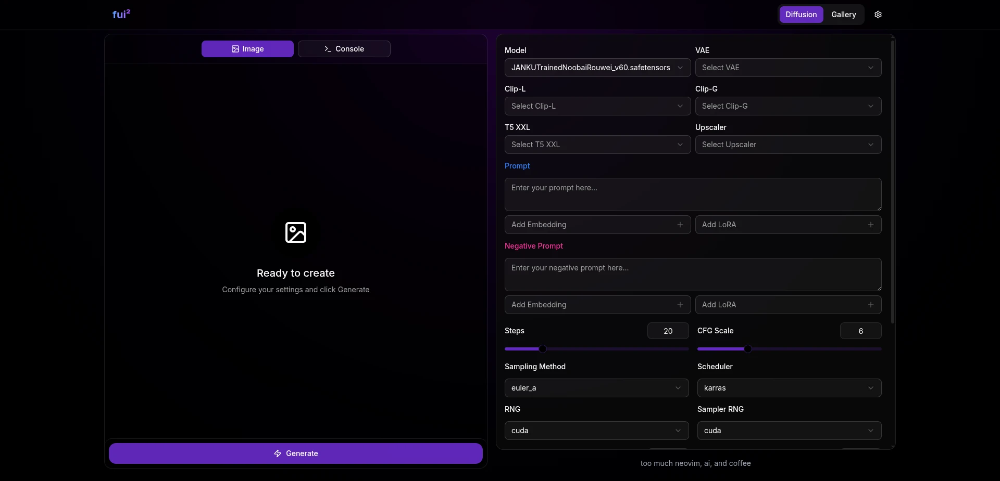

# fuifui

A simple, modern txt2img web UI for [stable-diffusion.cpp](https://github.com/leejet/stable-diffusion.cpp).



## Prerequisites

- **[Bun](https://bun.sh/)** as a runtime and package manager.
- **[stable-diffusion.cpp](https://github.com/leejet/stable-diffusion.cpp)**: You can place `sd` binary from `stable-diffusion.cpp` in `fuifui` directory or system's `$PATH`.

## Installation

1.  Clone the repository:

    ```bash
    git clone https://github.com/nullxception/fuifui.git
    cd fuifui
    ```

2.  Install dependencies:
    ```bash
    bun install
    ```

## Usage

### Production

To run the application in production mode:

```bash
bun start
```

### Development Server

To start the development server with hot reloading:

```bash
bun dev
```

The application will be available at `http://localhost:5141`.

## Configuration

In order to customize the application settings, you can create a `.env` file in the root directory. Simply copy the example file:

```bash
cp .env.example .env
```

### Available Settings

| Variable            | Default    |
| ------------------- | ---------- |
| `PORT`              | `5141`     |
| `FUIFUI_MODELS_DIR` | `./models` |

### Directory Layout

The application will automatically organize your files in this structure:

```
models/           # Your models collection (you can customize this path)
 ├─ checkpoint/   # Main model files
 ├─ vae/          # VAE enhancement files
 ├─ lora/         # LoRA style files
 ├─ embedding/    # Text embedding models
 ├─ upscaler/     # Image upscaling models
 └─ textencoder/  # Text encoder models
output/           # Your generated images (created automatically)
 └─ txt2img/      # Text-to-image creations
public/
 └─ upload/       # Files you upload from the web UI (created automatically)
config.yaml       # Your app preferences (created automatically when configuring from the web UI)
```
